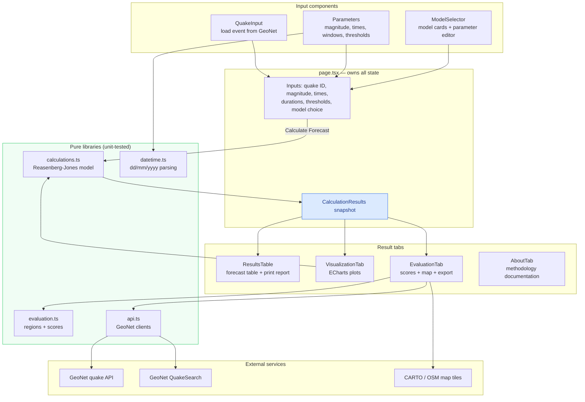
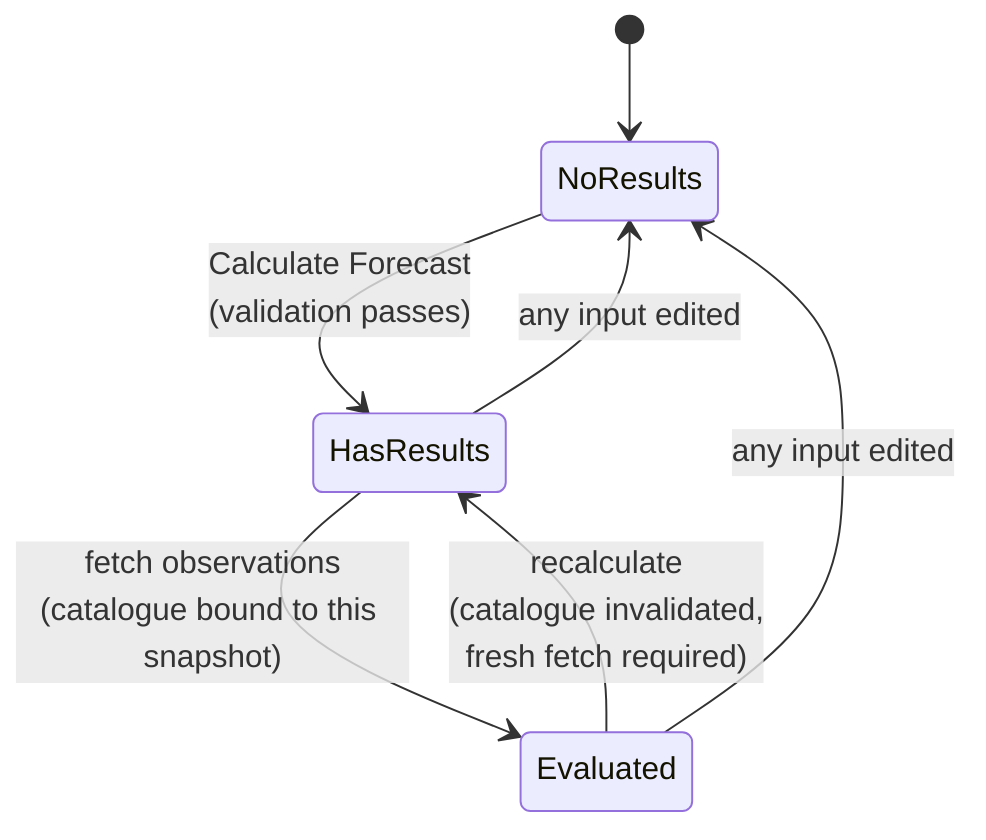

# Application Architecture

The Aftershock Calculator is a single-page Next.js application. All
calculation happens in the browser; the only network calls are to GeoNet
(earthquake data) and to map tile servers. There is no backend of our own and
no data leaves the user's machine.

## Component and data-flow map

## The results snapshot

The most important design decision is that pressing **Calculate Forecast**
produces an immutable snapshot object (`CalculationResults` in
`src/types/index.ts`) containing not just the formatted table rows but the
full inputs that produced them:

- the model parameters `a, b, c, p` actually used,
- the mainshock magnitude,
- the mainshock origin time and the forecast start offset in days,
- the epicentre, when known.

Every tab reads from this snapshot rather than from the live input fields.
The consequences:

1. **Consistency** — the table, every chart, and the evaluation all describe
   the same forecast, even while the user edits inputs for the next one.
2. **Exactness** — charts and the evaluation recompute values from the model
   in the snapshot rather than parsing rounded display strings, so nothing
   drifts through formatting.
3. **Invalidation** — editing any input clears the snapshot, which empties
   the result tabs until Calculate is pressed again; the evaluation
   additionally tracks *which* snapshot its observed catalogue was fetched
   for, and refuses to score a new forecast against an old catalogue.

## Layering rules

- `src/lib/` contains pure, framework-free logic, each module covered by a
  Vitest suite (`npm test`). Nothing in `lib/` imports React.
- Components own presentation and interaction state only; every number they
  display is produced by a `lib/` function.
- Charts (Apache ECharts) and the map (Leaflet 2) are loaded with
  tree-shaken/lazy imports so the initial bundle stays small; the map is
  client-only because Leaflet touches `window` at import time.

## Directory reference

| Path | Responsibility |
| --- | --- |
| `src/app/page.tsx` | State owner; wiring between inputs, calculation, and tabs |
| `src/components/QuakeInput.tsx` | Quake ID entry, GeoNet load, error display |
| `src/components/Parameters.tsx` | Magnitude, dd/mm/yyyy time fields with picker, windows, thresholds |
| `src/components/ModelSelector.tsx` | Model cards, parameter summary and editor |
| `src/components/ResultsTable.tsx` | Forecast table, print report |
| `src/components/VisualizationTab.tsx` | Overview and detailed ECharts plots |
| `src/components/EvaluationTab.tsx` | Evaluation workflow, scores, exports |
| `src/components/EvaluationMap.tsx` | Leaflet map of region and observed events |
| `src/components/AboutTab.tsx` | In-app methodology documentation (KaTeX) |
| `src/components/InfoTooltip.tsx` | Portal-based tooltip, clipping-proof |
| `src/lib/calculations.ts` | Reasenberg–Jones model, Poisson quantiles, formatting |
| `src/lib/evaluation.ts` | Spatial regions, catalogue matching, scores |
| `src/lib/api.ts` | GeoNet quake lookup and QuakeSearch catalogue client |
| `src/lib/datetime.ts` | Day-first date-time parsing/formatting |
| `src/types/index.ts` | Shared types, model presets and descriptions |
| `src/types/leaflet.d.ts` | Local type declarations for Leaflet 2 (no official types yet) |

## Verification

Every change is expected to pass four gates: `npx tsc --noEmit` (types),
`npm run lint` (ESLint), `npm test` (Vitest unit tests for all `lib/`
modules), and `npm run build` (production build).
