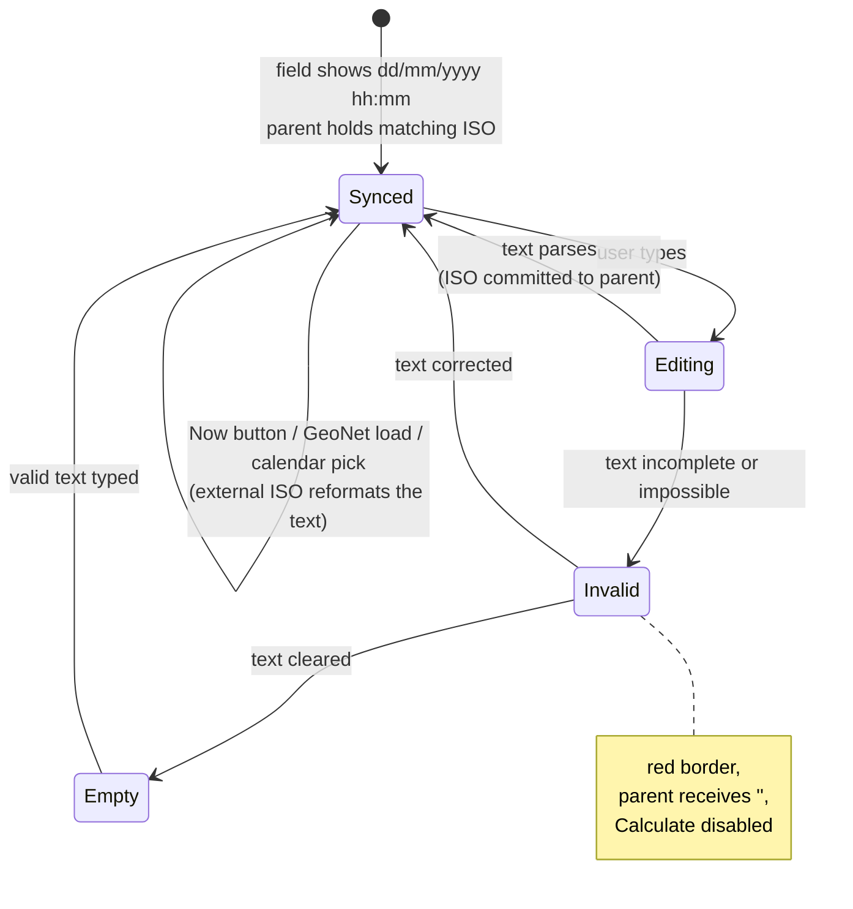

# Date and Time Handling

Dates in this application are always **displayed and entered day-first**
(dd/mm/yyyy hh:mm, 24-hour, local time) and always **stored as ISO 8601 UTC**
internally. This document explains why, and how the custom field works.

## Why not native datetime inputs?

The obvious implementation is `<input type="datetime-local">`, and the app
originally used it. The problem: browsers render that input in the
**operating system's locale**, and there is no web API to override the
format. On a US-configured machine the field displays month-first
(mm/dd/yyyy), which is exactly the ambiguity a New Zealand scientific tool
must not have — 11/03 silently means two different dates to two readers.

The replacement is an explicit text field that guarantees day-first entry on
every machine, with the native **calendar picker retained** through a hidden
input that supplies the picker UI but never displays a date itself.

## The field's behaviour

Key properties:

- **Day-first is enforced, not assumed.** "11/13/2016" (American order) is
  *rejected* because month 13 does not exist — the classic dd/mm vs mm/dd
  data corruption cannot happen silently.
- **Impossible dates are rejected, not rolled over.** 31/02/2020 and
  29/02/2023 are errors; 29/02/2024 is accepted (leap years handled). A naive
  `new Date()` would silently turn 31/02 into 02/03 or 03/03.
- **Invalid text disables calculation.** While the text does not parse, the
  parent receives an empty value, so a forecast can never be computed against
  a stale or misread time.
- **Single-digit entry is normalised**: `5/3/2024 9:07` becomes
  `05/03/2024 09:07`.

## The calendar picker

The calendar button next to each field opens the browser's native
date-and-time picker via a visually hidden `datetime-local` input and
`showPicker()`. The picker opens pre-set to the field's current value; the
chosen value is converted to ISO and written back into the visible field in
dd/mm/yyyy form. The hidden input's own (locale-dependent) text rendering is
never shown — it exists only to summon the calendar. Browsers without
`showPicker()` fall back to focusing the hidden input; and if no picker is
available at all, typed entry always works, so the picker is an enhancement,
never a dependency.

## Storage and display conventions

| Context | Format | Why |
| --- | --- | --- |
| Internal state, `CalculationResults`, CSV metadata | ISO 8601 UTC | unambiguous, sortable, timezone-safe |
| Input fields | dd/mm/yyyy hh:mm, local time | NZ convention, day-first guaranteed |
| Formatted displays (banners, print reports) | `en-NZ` locale via `toLocaleString` | consistent day-first rendering |
| Map tooltips and popups | ISO `yyyy-mm-dd hh:mm UTC` | scientific data display; catalogue times are UTC |

