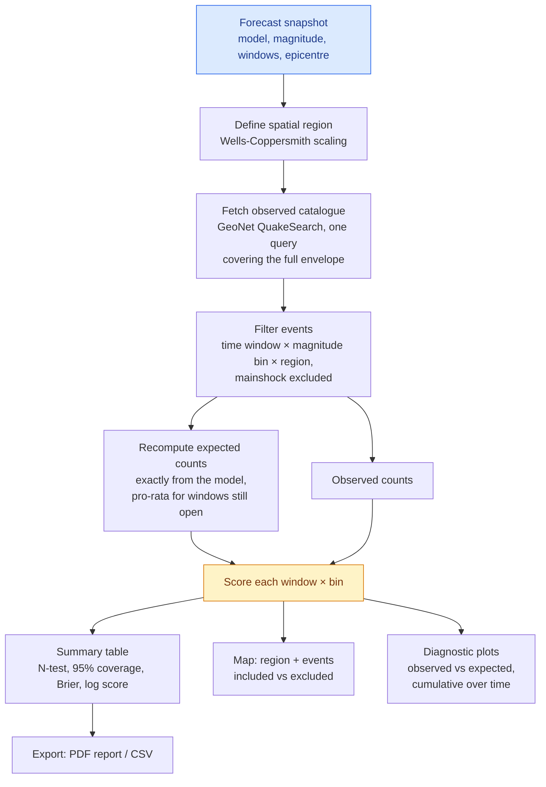
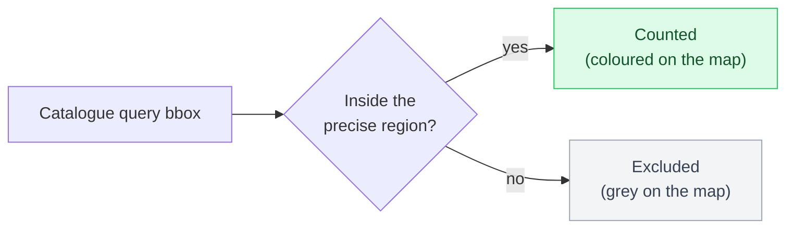
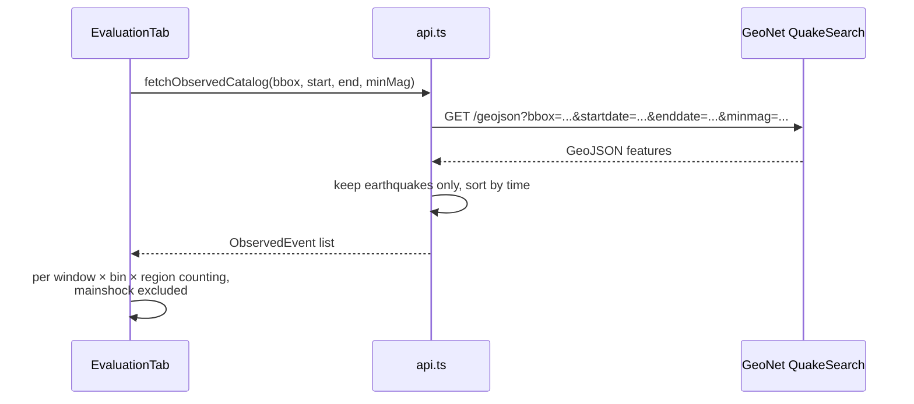

# Forecast Evaluation Methodology

The Evaluation tab tests a forecast retrospectively against what actually
happened, using the observed GeoNet catalogue. The approach follows the
practice of the Collaboratory for the Study of Earthquake Predictability
(CSEP): state the forecast precisely, define the target region and window in
advance, count what occurred, and score the comparison with proper metrics.

## The workflow



## Step 1 — The spatial region

The evaluation counts events near the mainshock, within a radius scaled to
the rupture size:

```math
\log_{10} L = -2.44 + 0.59\,M_w \qquad \text{radius} = k \times L
```

using the Wells & Coppersmith (1994) subsurface rupture length relation (all
slip types). The multiplier k is user-selectable (0.5–3, default 1), and the
radius is floored at 10 km so small events still get a region larger than
typical epicentral uncertainty. For the Kaikōura M7.8 demo, L ≈ 145 km.

Two region shapes are offered:

- **Circle**: membership by great-circle (haversine) distance ≤ radius.
- **Equal-area square**: half-width $r\sqrt{\pi}/2$, so both shapes cover the
  same area (πr²) and results are comparable between them.

The catalogue is fetched with a bounding box that covers the region, then the
precise shape test is applied client-side. Longitude arithmetic is
dateline-safe, so regions near 180° (east coast, Chatham Islands) work
correctly.



Showing the excluded events in grey on the map is deliberate: the counts are
auditable at a glance.

## Step 2 — The observed catalogue

One QuakeSearch request covers the whole evaluation: the union of all
forecast windows, at the lowest threshold, within the bounding box. Filtering
per window and bin then happens locally.



Rules applied to the raw catalogue:

- non-earthquake event types (quarry blasts etc.) are dropped;
- the mainshock itself is always excluded from counts;
- a response of 3000+ events triggers a truncation warning, since very large
  queries can hit server limits.

## Step 3 — Matching forecasts to observations

Each forecast window × magnitude bin becomes one evaluation row. Windows are
anchored in real time: origin time + forecast start offset, extending for the
window length.

- **Completed windows** are scored in full.
- **Windows still in progress** are scored over the elapsed portion only,
  with the expected count integrated over that same elapsed period (the
  model's time-decay makes this exact, not a linear approximation). These
  rows are flagged "in progress".
- **Entirely future windows** are excluded ("not yet observable").

A recalculated forecast invalidates any previously fetched catalogue: the
query envelope or magnitude floor may no longer match, so a fresh fetch is
required rather than silently scoring mismatched data.

## Step 4 — The scores

| Score | Question it answers | Reading it |
| --- | --- | --- |
| **N-test** (Zechar 2010) | Is the observed count consistent with the forecast expectation? | Two-sided Poisson test at 5%. "Overprediction": significantly fewer events occurred than forecast. "Underprediction": significantly more. |
| **95% range coverage** | Did the count fall inside the forecast's stated range? | Out-of-range counts are highlighted in red. |
| **Brier score** | How accurate was the "chance of one or more" probability? | 0 perfect, 1 worst; below 0.25 beats an uninformative 50% forecast. |
| **Log score** | Same question, punishing confident misses hardest | 0 perfect; lower is better; probabilities are clamped at 10⁻⁶ so the penalty is capped. Differences in average log score between models measure information gain. |
| **Poisson log-likelihood** | How well does the expectation explain the exact count? | For comparing models on the same observations; exported in the CSV. |

A single window is weak evidence either way — one lucky or unlucky outcome
says little. The N-test verdict is the defensible headline for a single
evaluation; the probability scores become meaningful when averaged across
many forecasts.

## Documented assumptions and caveats

- Counts are assumed Poisson; model-parameter uncertainty is not propagated,
  so stated ranges are somewhat narrow.
- GeoNet magnitudes mix magnitude types (mostly local magnitude), while the
  model nominally uses moment magnitude; small systematic offsets are
  possible.
- Catalogues under-report small events in the hours after a large mainshock
  (short-term incompleteness); a warning appears when the lowest threshold is
  below M3.
- The epicentre-centred region is an approximation for long ruptures, where
  the aftershock zone is elongated along the fault; a polygon region would be
  the natural refinement.
- "Cooper and Smith" in early specifications refers to Wells & Coppersmith
  (1994); swapping in an NZ-specific scaling relation is a one-function
  change in `src/lib/evaluation.ts`.

