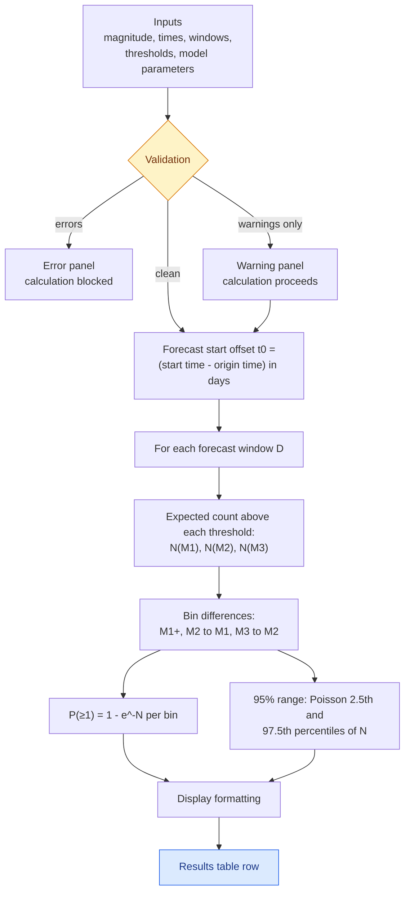
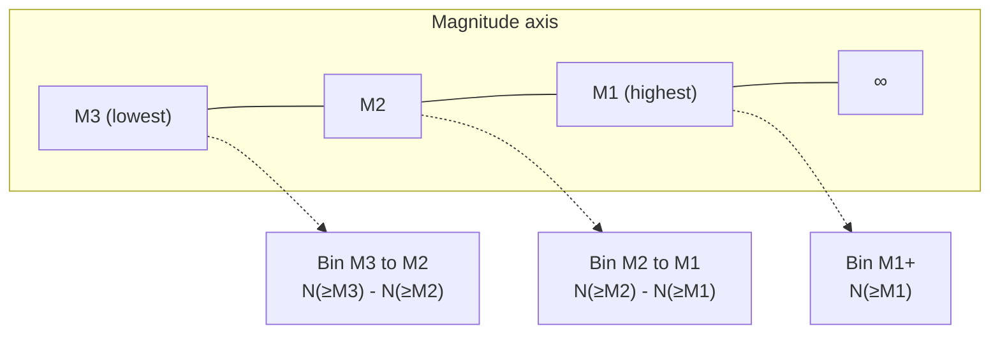

# The Forecast Computation

This document walks through what happens between pressing **Calculate
Forecast** and seeing the results table: validation, the Reasenberg–Jones
model, magnitude bins, confidence ranges, and display formatting.

## From inputs to the table



## Step 1 — Two levels of validation

| Level | Examples | Effect |
| --- | --- | --- |
| **Hard** (blocks calculation) | magnitude outside (0, 10); thresholds out of order; start time before origin time; duplicate windows; b, c or p ≤ 0 | Red error panel; nothing is computed |
| **Soft** (warns only) | parameters outside published literature ranges (e.g. b outside 0.5–1.5) | Amber warning panel; calculation proceeds |

The hard checks exist because certain values make the mathematics undefined —
for example c = 0 with a forecast starting at the origin time puts a division
by zero inside the Omori integral. The same guards are enforced a second time
inside `calculateDurationForecast` as defence in depth.

## Step 2 — Expected counts above each threshold

For each window and each threshold M, the expected number of events of
magnitude ≥ M is:

```math
N(\geq M) = 10^{\,a + b\,(M_m - (M - 0.05))} \times \frac{(t_0 + D + c)^{1-p} - (t_0 + c)^{1-p}}{1-p}
```

with the logarithmic form $\ln\frac{t_0+D+c}{t_0+c}$ at $p = 1$ (the code
switches within a floating-point epsilon of 1). The 0.05 term is a bin-edge
correction: a threshold of M5 counts events that would round to 5.0 or above
in a catalogue reported to one decimal place.

## Step 3 — From cumulative counts to bins

The table reports three ranges built from the cumulative counts:



The bins are what the results table shows; the visualization overview and the
evaluation recombine them into cumulative M≥ thresholds where that is the more
natural framing. Bin sums and cumulative counts are tested to agree exactly.

## Step 4 — Probability and range per bin

- **Probability of one or more events**: $P(\geq 1) = 1 - e^{-N}$, from the
  Poisson assumption.
- **95% range**: the 2.5th and 97.5th percentiles of a Poisson distribution
  with mean N, computed by `qpois` in `src/lib/calculations.ts`. For
  N ≤ 100 the quantile is found by exact CDF inversion; above that a normal
  approximation ($N \pm z\sqrt{N}$, Abramowitz–Stegun inverse) avoids
  floating-point underflow. This range reflects counting statistics only — it
  does not include uncertainty in the model parameters, and is therefore
  narrower than the true predictive interval.

## Step 5 — Display formatting

| Quantity | Rule | Examples |
| --- | --- | --- |
| Expected count ≥ 100 | round to integer | 128 |
| Expected count 1–100 | two significant figures | 5.7, 64 |
| Expected count < 1 | one significant figure | 0.2, 0.006 |
| Probability > 99% | shown as ">99%" | never a false "100%" |
| Probability < 1% | shown as "<1%" | never a false "0%" |

The probability caps matter scientifically: the model never assigns exactly 0
or 1, so the display never claims certainty. Chart tooltips quote these exact
table strings rather than re-deriving them, so no chart can disagree with the
table.

## Model presets

| Model | a | b | c (days) | p | Source |
| --- | --- | --- | --- | --- | --- |
| NZ Generic | −1.59 | 1.03 | 0.04 | 1.07 | ESNZ calibration |
| Subduction Zone | −1.97 | 1.0 | 0.018 | 0.92 | ESNZ, NZ subduction sequences |
| California (ACR) | −1.67 | 0.91 | 0.05 | 1.08 | Reasenberg & Jones (1989) |
| Stable Continental | −2.5 | 1.0 | 0.05 | 1.0 | Page et al. (2016) |
| Custom | user-defined | | | | defaults to NZ Generic |

These are generic calibrations averaged over many sequences. An individual
sequence can differ substantially — operational agencies re-fit parameters as
a sequence develops, so forecasts from presets are indicative rather than
official.

