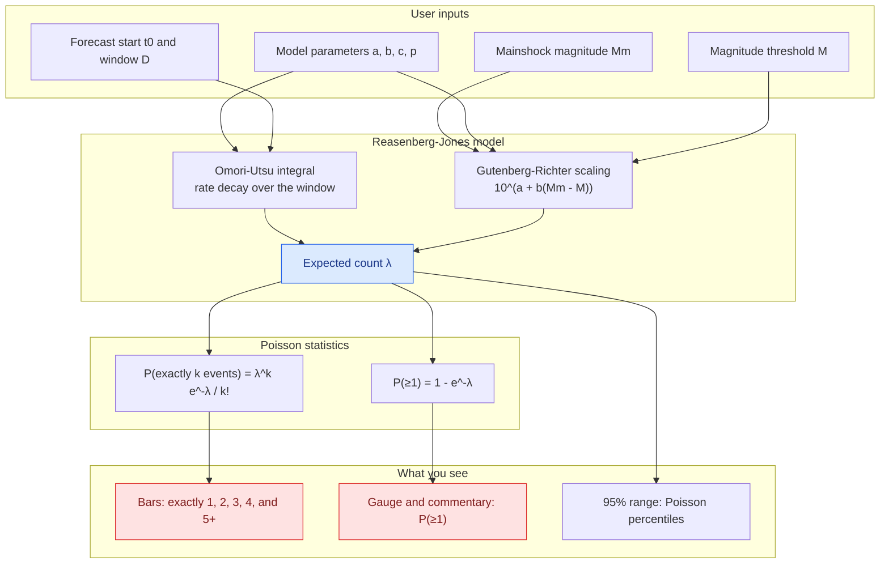
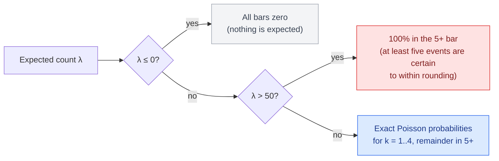

# How the "Likely Number of Aftershocks" Is Computed

This document explains, step by step, how the Poisson outcome chart on the
Visualization tab turns the forecast model into the probability bars you see,
and why the chart, the gauge, and the commentary always agree with each other.

## The pipeline at a glance



The single value that everything hangs off is the **expected count λ**
(lambda). It is computed once and reused by every display element, which is
why the bars, the gauge, and the commentary can never disagree.

## Step 1 — Expected number of aftershocks (λ)

For the selected magnitude threshold *M* and forecast window, the app
evaluates the Reasenberg–Jones model exactly:

```math
\lambda = 10^{\,a + b\,(M_m - (M - 0.05))} \times \int_{t_0}^{t_0 + D} (t+c)^{-p}\, dt
```

where:

| Symbol | Meaning |
| --- | --- |
| $M_m$ | mainshock magnitude |
| $M$ | selected magnitude threshold (0.05 is the bin-edge correction for catalogues reported to one decimal place) |
| $a, b, c, p$ | the forecast model parameters |
| $t_0$ | days between the mainshock and the forecast start |
| $D$ | forecast window length in days |

The integral has a closed-form solution,
$\frac{(t_0+D+c)^{1-p} - (t_0+c)^{1-p}}{1-p}$, with a logarithmic special
case at $p = 1$.

This is a **cumulative** count (all events of magnitude $\geq M$), which is
why the M4+ expectation is roughly ten times the M5+ expectation when
$b \approx 1$ — the Gutenberg–Richter relation at work.

## Step 2 — From one number to a distribution of outcomes

The model's λ is an *average*. The actual number of aftershocks in any real
window is a random count, modelled as **Poisson-distributed** with mean λ:

```math
P(X = k) = \frac{\lambda^k e^{-\lambda}}{k!}
```

## Step 3 — The bars

- The bars for **exactly 1, 2, 3, and 4** events are the Poisson
  probabilities above, converted to percentages and rounded to one decimal.
- The **"5+"** bar is the remainder: $100\% - \sum_{k=0}^{4} P(X=k)$, so the
  tail of the distribution is aggregated rather than lost.
- The **zero-event outcome is computed but not drawn**. As a result the
  visible bars sum exactly to the headline probability of one or more
  aftershocks, $P(\geq 1) = 1 - e^{-\lambda}$ — the same number shown by the
  gauge and the commentary.

### Special cases



## Worked example — Kaikōura demo

M7.8 mainshock, threshold M7.0+, 30-day window starting one hour after the
mainshock. The model gives $\lambda \approx 1.1$, so $e^{-\lambda} \approx 0.333$:

| Outcome | Formula | Probability |
| --- | --- | --- |
| exactly 1 | $\lambda e^{-\lambda}$ | 36.6% |
| exactly 2 | $\lambda^2 e^{-\lambda} / 2$ | 20.1% |
| exactly 3 | $\lambda^3 e^{-\lambda} / 6$ | 7.4% |
| exactly 4 | $\lambda^4 e^{-\lambda} / 24$ | 2.0% |
| 5 or more | remainder | 0.6% |

The five bars sum to about 66.7% — exactly the $P(\geq 1)$ the gauge
reports — and the undrawn 33.3% is the "no M7+ aftershock" outcome.

For comparison, the same window at the M5.0+ threshold gives
$\lambda \approx 128$, which trips the $\lambda > 50$ special case: at least
five events are effectively certain, so the whole distribution sits in "5+".

## Caveat

The Poisson spread assumes λ is known exactly. Real sequences are somewhat
more variable, because the model parameters are themselves uncertain and
aftershocks cluster. The bars are the model's honest answer, but the true
outcome distribution is a little wider than shown — see the About tab's
"How Forecasts Are Evaluated" section for how this is handled when scoring
forecasts against observations.
